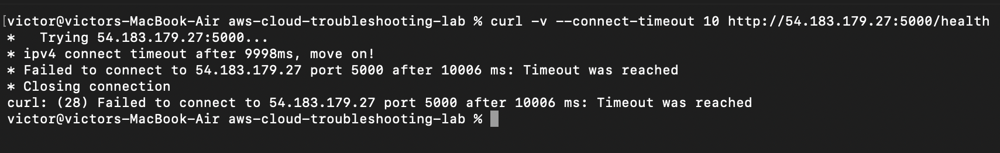
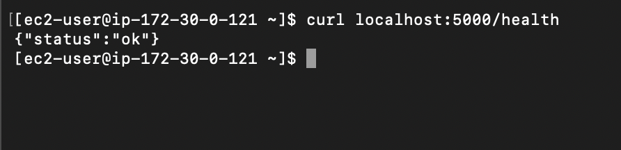
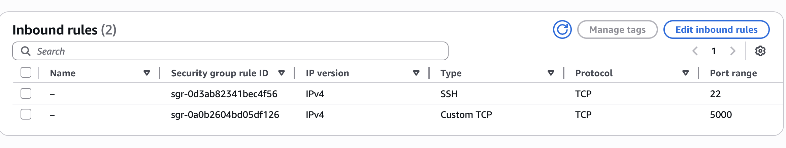
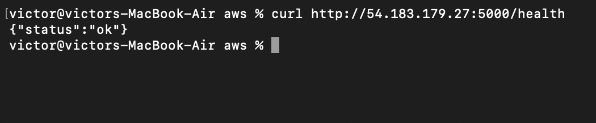

# Troubleshooting Scenario 01: App Unreachable Due to Blocked Port

## Scenario Type
Simulated lab scenario

## Goal
Practice troubleshooting a common EC2 issue: the app is running on the instance, but it cannot be reached from my local machine.

## Failure Introduced
I temporarily removed the inbound security group rule for TCP port 5000.

## Expected Behavior
The Flask app should respond from my local machine:

```bash
curl http://54.183.179.27:5000/health
```

## Observed Behavior
After I removed the inbound rule, requests from my local machine timed out.

## Diagnosis
First, I checked whether the service was still running on the EC2 instance:

```bash
sudo systemctl status aws-troubleshooting-lab
```

Then I tested the app from inside the instance:

```bash
curl http://localhost:5000/health
```

That request worked, so the Flask app itself was healthy. The issue had to be somewhere between my local machine and the EC2 instance.

## Root Cause
The security group was blocking inbound traffic on TCP port 5000.

## Fix
I added the inbound rule back to the EC2 security group:

Custom TCP | TCP | 5000 | 0.0.0.0/0

note: I used `0.0.0.0/0` because my IP changes when using a VPN. In a production environment, I would avoid opening this port publicly and would restrict access to known IP ranges.


## Verification
After restoring the rule, I tested the endpoint again from my local machine:

```bash
curl http://54.183.179.27:5000/health
```

The health endpoint responded successfully.

## What I Learned
This was a good reminder to check both the app and the network path. The service can be running normally on the instance, but still be unreachable if the security group blocks the port.

## Screenshots

### External request timed out



### App responded locally on EC2



### Security group rule restored



### External request succeeded after fix

