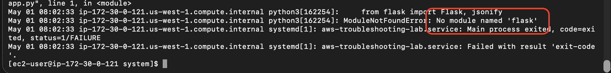
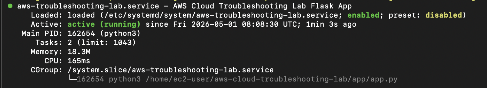
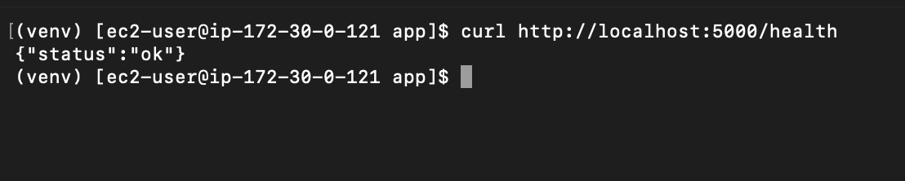

# Troubleshooting Scenario 03: Missing Python Dependency

## Scenario Type
Simulated lab incident

## Goal
Practice diagnosing an application startup failure caused by a missing Python package.

## Environment
- AWS EC2
- Amazon Linux
- Python Flask
- Python virtual environment
- systemd
- journalctl
- curl

## Failure Introduced
I intentionally removed Flask from the application's virtual environment:

Then I restarted the systemd service:

```bash
sudo systemctl restart aws-troubleshooting-lab
```

## Symptoms
The EC2 instance was still reachable through SSH, but the Flask application failed to start.

The local health check failed:

```bash
curl http://localhost:5000/health
```

The external health check also failed:

```bash
curl http://54.183.179.27:5000/health
```

## Diagnosis
I checked the systemd service status:

```bash
sudo systemctl status aws-troubleshooting-lab
```

The service was not running successfully.

I then reviewed recent service logs:

```bash
journalctl -u aws-troubleshooting-lab -n 50 --no-pager
```

The logs showed that the Python application could not import Flask:

```bash
ModuleNotFoundError: No module named 'flask'
```

## Root Cause
The Flask package was missing from the Python virtual environment used by the systemd service.

Because the application imports Flask during startup, the service failed before it could begin listening on port 5000.

## Fix
I reinstalled the project dependencies from requirements.txt.

Then I restarted the systemd service:

```bash
sudo systemctl restart aws-troubleshooting-lab
```

I confirmed the service was active:

```bash
sudo systemctl status aws-troubleshooting-lab
```

I tested the health endpoint locally from the EC2 instance:

```bash
curl http://localhost:5000/health
```

I also tested the health endpoint externally from my local machine:

```bash
curl http://54.183.179.27:5000/health
```

Both returned a successful health check response.

## What I Learned
Application startup failures can be caused by missing packages inside the runtime environment. systemd status shows whether the service is running, but journalctl provides the error details needed to identify the cause.

## Screenshots

### Failure logs



### Fixed service and health check


